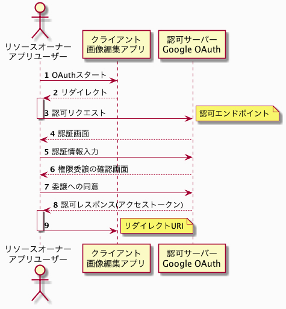
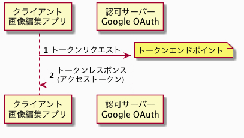
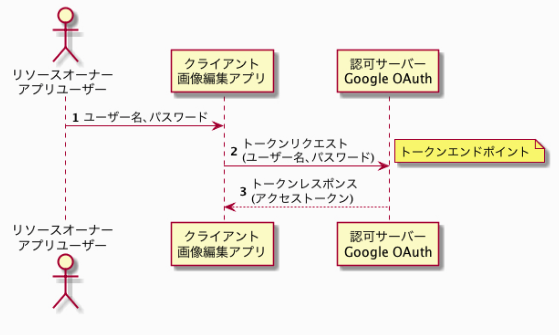
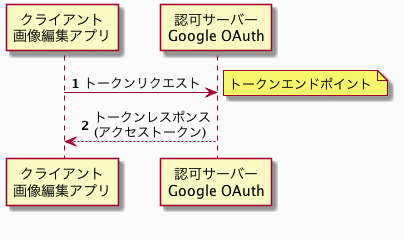
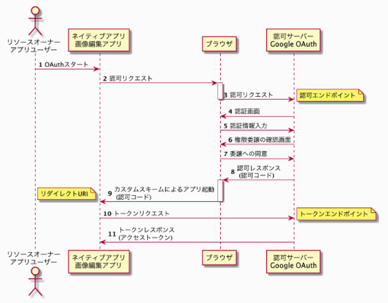

```toc
```

# OAuth とはなにか

OAuth 標準仕様である、RFC6749 より：

> OAuth2.0はサードパーティアプリケーションによるHTTPサービスへの限定的なアクセスを可能にする認可フレームワークである。


## サードパーティアプリケーション

- サードパーティアプリなど、ユーザーが触るアプリケーション
    - 例：画像編集アプリ

## HTTP サービス

- HTTP アクセスによって、サービスを提供する側。API を公開して、サードパーティアプリからサービスの中身を利用できるようにする。
    - 例：Google Photo

## 限定的なアクセス

- HTTP サービスはサードパーティアプリが何でもかんでもできるするわけではなくて、一部の操作のみ許可する。サードパーティアプリが要求する権限一覧をユーザーに提示し、ユーザーからの権限の移譲についての同意が完了してから、許可して良い操作が何かを知ることができる。
    - 例：Google Photo は画像ダウンロードのみ許可し、アップロードや削除は許可しない

## 認可フレームワーク

- アクセストークン（許可して良いアクセスかどうかを判断するのに使われるもの）の発行方法についてのルール。
    - 例：Google OAuth サービス

# OAuth が必要な理由

- OAuth を使えば、ユーザーはサードパーティアプリにHTTPサービスのユーザー名やパスワードを教える必要がない。
    - ユーザー名とパスワードを渡してしまうと、画像編集アプリからあらゆる操作ができてしまう。
    - 画像編集アプリが悪意のあるものによって作成されたアプリだと判明した場合に、サードパーティアプリからのアクセスを遮断する手立ては、パスワード変更しかなくなる。
    - 画像編集アプリがユーザー名とパスワードを保持している場合、画像編集アプリが攻撃を受けると漏洩する可能性がある。

# OAuth のロール


## リソースオーナー

- リソースの所有者
    - リソース：Google Photo の画像や動画
    - リソースオーナー：画像編集アプリのユーザー
- OAuth の文脈では、直接リソースを触ることなく、間接的にリソースにアクセスする
- リソースオーナーはクライアントに権限を委譲する。

## クライアント

- リソースサーバーを利用するアプリ
- クライアントの認証情報（クライアントIDとクライアントシークレット）をセキュアに保存できるかでふたつのクライアントタイプを定義
    - セキュアに保存できる場合：コンフィデンシャルクライアント
        - サーバーサイドのウェブアプリケーション
    - セキュアに保存できない場合：パブリッククライアント
        - ブラウザベースのウェブアプリやネイティブアプリ

## リソースサーバー

- いわゆる Web API
- リソースオーナーが許可したアクセスのみ受け入れる必要がある。その確認手段がアクセストークン。
- リソースサーバーへのアクセスには、常にアクセストークンが含まれていなければならない。

## 認可サーバー

- アクセストークンを発行するサーバー
- 機能は3つ：
    - リソースオーナーを認証する
        - HTTPサービスにあるリソースのリソースオーナーであることを確かめるための認証
        - 一般的にリソースオーナーは2度のID・パスワードを入力することを求められる（画像編集アプリ+GooglePhoto）
    - クライアントのリソースへのアクセスについて、リソースオーナーの同意を得る
    - アクセストークンを発行する

## 4つのロールの関係


1. クライアントは認可サーバーに対して「リソースへのアクセス権」を要求する
2. 認可サーバーは「クライアントへのアクセス権の委譲」についてリソースオーナーの意思を確認する
3. リソースオーナーはアクセス権の委譲について同意する
4. 認可サーバーはアクセス権が委譲された証(アクセストークン)を発行する
5. クライアントはアクセストークンをもってリソースへのアクセスが可能になる

# OAuth のトークン

OAuth に関連するトークンはすべて認可サーバーからクライアントに向けて発行される。

## アクセストークン

- 次の2つの情報がひもづいいている
    - 誰のどのリソースにどのような操作を行うことが許可されているか
    - 有効期限はいつまでか
- OAuth のアクセストークンは Bearer トークン
    - Bearer トークン（署名なしトークン）は [RFC6750](http://openid-foundation-japan.github.io/rfc6750.ja.html) で定義されている通り：

        > セキュリティトークン. トークンを所有する任意のパーティ (持参人 = bearer) は, 「トークンを所有している」という条件を満たしさえすればそのトークンを利用することができる. 署名無しトークンを利用する際, 持参人は, 暗号鍵の所持を証明 (proof-of-posession) するよう要求されない.

    - つまり、アクセストークンの送信元を確認しない。アクセストークンを所有してさえいれば、（それが不正に入手したものでも）アクセストークンに紐付けられた権限でリソースにアクセスが可能。
- レスポンスの例

    ```
    HTTP/1.1 200 OK
      Content-Type: application/json;charset=UTF-8
      Cache-Control: no-store
      Pragma: no-cache

      {
        "access_token":"mF_9.B5f-4.1JqM",
        "token_type":"Bearer",
        "expires_in":3600,
        "refresh_token":"tGzv3JOkF0XG5Qx2TlKWIA"
      }
    ```

### スコープ

- アクセストークンに紐づくアクセス権をコントロールするための仕組み。
- クライアントが要求するスコープは必要とする最小限の権限にとどめておくべき。

### 有効期限

- 有効期限を過ぎたアクセストークンを付与したアクセスはリソースサーバーによって拒否される。
- アクセストークンの有効期限は、リフレッシュトークンの有効期限に比べて、短い時間に設定することが一般的。

## リフレッシュトークン

- クライアントから認可サーバーに対してのアクセストークンの再発行を要求する際に利用される。
- 標準仕様では必須とされていないので、発行されない場合もある。
- アクセストークンはクライアントからリソースサーバに送られるのに対して、リフレッシュトークンは認可サーバーに送られる点が違う。
- アクセストークンに比べて、遥かに長い有効期限を持つ。

## 認可コード

- 認可コードは「リソースオーナーがクライアントへの権限委譲に同意した証」として発行されるもの。
- クライアントから認可サーバーに対してアクセストークンを要求する際に利用される。
    1. 認可サーバーはリソースオーナーのユーザー名、パスワードを確認し、アクセス権の委譲に関する同意を得ると認可コードを生成し、HTTPリダイレクトを利用してクライアントに送信する。
    2. クライアントはトークンエンドポイントにアクセストークンを要求する際に、認可コードを利用する。
- 認可コードが利用できるのは一度だけ。
- 認可コードの有効期限は通常数分程度の非常に短い時間に設定される（10分程度）

# OAuth のエンドポイント

## 認可エンドポイント

- 認可コードの発行が主な役割
- クライアントがアクセス権を持っていないリソースにアクセスする際にまずアクセスするところ。
- ユーザー名とパスワードなどによって、リソースオーナーの認証が行われる。
- 認証が完了すると、リソースオーナーはリソースへのアクセス権をクライアントに移乗することについての同意を求められる。リソースオーナーが同意すると、同意の証として、認可コードがリダイレクトエンドポイントに送られる。

## トークンエンドポイント

- 認可サーバーによって提供される。
- 認可コードを受け取ったクライアントが、認可コードと共に必要なパラメータを指定して、トークンエンドポイントにリクエストを投げることで、アクセストークンを取得できる。
- トークンエンドポイントでは、Basic認証によって、クライアントのアイデンティティが確認される。
    - Authotization ヘッダに設定されるのは、クライアント ID とクライアントシークレット
    - クライアント ID とクライアントシークレットは認可サーバにクライアントを事前登録する際に発行される。

## リダイレクトエンドポイント（リダイレクトURI）

- クライアントが提供する。
- 認可サーバーから認可コードを受け取るために使用される。
- 認可サーバーは、リソースオーナーの権限委譲の同意がおこなわれると、ステータスコード302のレスポンスを返してリダイレクトURIにブラウザーをリダイレクトする。その際、クエリパラメーターとして認可コードの値が渡される。

# OAuth のグラントタイプ

OIDC では「フロー」と表現している。権限付与（委譲）のタイプのこと。

## クライアントの登録

- クライアントの開発者は、リソースを提供する組織に対して、クライアント情報を登録し、クライアントID、クライアントシークレットの発行を受ける必要がある。
- IDやシークレットの発行方法については、標準で規定されていないが、一般的には、認可サーバーおよびリソースサーバを提供する組織が提供する開発者向けサイトにて発行される。
- 開発者がクライアント情報として登録する最も大事な情報は、リダイレクトURI

## 認可コードグラント


1. 認可コードの取得（図の9まで）
2. アクセストークンの取得（図の11まで）
3. リソースへのアクセス（図の13まで）

## インプリシットグラント




## クライアントクレデンシャルグラント



## リソースオーナーパスワードクレデンシャルグラント




## リフレッシュトークンによるアクセストークン再発行



## 認可コードグラント + PKCE


